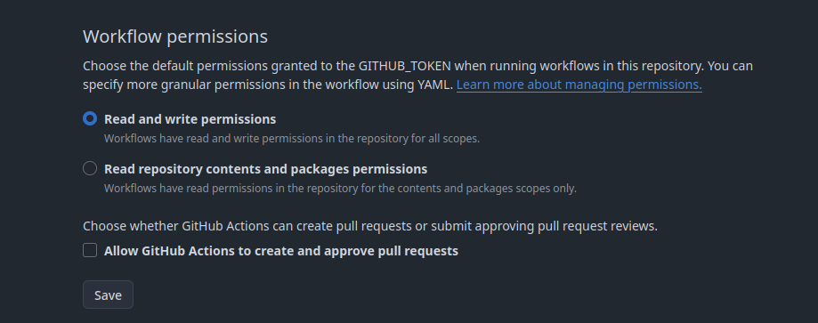
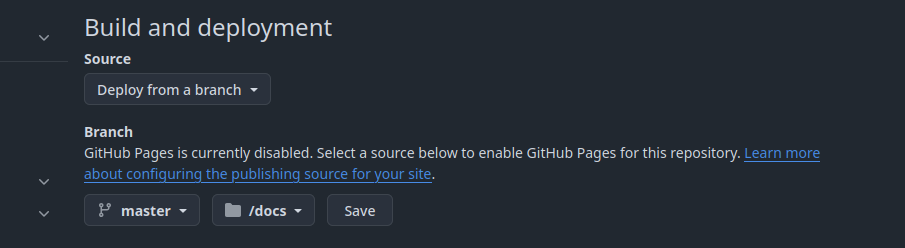

<h2 align="center">
<br/>
<br/>
Liveboat Github Runner
</h2>


### See it in [Action](https://konrad.website/liveboat-github-runner)

<br/>
This is template repository for <a href="https://github.com/exaroth/liveboat">Liveboat</a> feed generator, use it to configure and deploy feed websites on Github Pages. Follow instructions below for more details.

## Installation

Prerequisites: 
- Existing Newsboat configuration, in particular `urls` file. If you're not familiar with Newsboat yet see [Newsboat url file breakdown](#newsboat-url-file-breakdown) section below for instructions on how to add  RSS/Atom feeds.
- Github account

__STEP 1__ Create new Github repository from `liveboat-github-runner` template

- Click `Use this template` in the upper right corner
- Select repository name and privacy settings

> [!NOTE]
> Repository can be private or public however note that hosting project pages from private repos is only available for Github Pro users.

- After the repository has been created use `git clone` to download it

__STEP 2__ Update configuration and urls file
- `cd` into the cloned repository
 
- First edit `./config/liveboat-config.toml` file, update `title` and most importantly `site_path` - this option needs to be set to `/<repo_name>/` where `repo_name` corresponds to repository name created in Step 1.

- Next replace feeds url in `./config/newsboat-urls` with those you want to follow - If you're existing Newsboat user simply copy contents of the `urls` file (typically stored at `~/.newsboat/urls`)

> [!NOTE]
> Order of the URLs does matter as it will reflect order of feeds in generated page.

- Commit all the changes and `git push` them back to remote
 
__STEP 3__ Update settings for the repository

1. Go to `Settings->Actions->General` page within the repo created in Step 1. In `Workflow Permissions` section set `Read and write permissions` and click `Save`.

2. Still in Project Settings go to `Pages` tab and under `Build and deployment`, set `Source` to `Deploy from branch`, set `Branch name` to `master` and select `/docs` as the folder to deploy Pages from. Click `Save`.


__STEP 4__ Finally going back to terminal execute
``` sh
git tag build && git push --tags
```
To execute page rebuild job.

> [!TIP]
> Pushing any tag starting with `build` will execute page rebuild.

__DONE__ Wait until Github Action finishes execution, then navigate to the repo Github Page `https:://<username>.github.io/<repo_name>` and verify everything is as expected.

## Changing page appearance
Default template allows basic level of color customization, if you want to change color theme edit `./templates/default/config.toml` file and update color values to those that suit your needs

```
[template_settings]
text-color = "#c7cfcc"
highlight-color = "#73bed3"
accent-color = "#3c5e8b"
background-color = "#181818"
```

For more advanced template modifications see [Template development guide](https://github.com/exaroth/liveboat/tree/develop/templates).

> [!IMPORTANT]
> When using modified version of default template do not replace contents of `./templates/default` as these might be overwritten during update, instead put it in separate directory and update `--template-path` value in `.github/workflows/workflow.yml` file.

## Newsboat URL file breakdown
This section goes over basic Newsboat URL file syntax you will need to add your own feeds to autogenerated Liveboat pages. For more detailed overview see [Newsboat documentation page](https://newsboat.org/releases/2.10.2/docs/newsboat.html)

##### Basic example
You can simply add urls to Atom/RSS feeds, one per line, eg.
```
https://hnrss.org/best
https://access.acast.com/rss/theeconomistmorningbriefing/default
```
##### Adding custom titles
Above example will work just fine however feed titles might not be exactly what you want, this can be alleviated by overwriting them, this is done by adding ` "~<Title>"` for the line eg.
```
https://hnrss.org/best "~HN" 
https://access.acast.com/rss/theeconomistmorningbriefing/default "~Daily Brief"
```

##### Aggregating feeds
You can group related feeds using tags and query feeds, to tag particular feed simply append tag name to the line, and create new query feed with matching tags via `query:` syntax. Example:

```
https://hnrss.org/best "~HN" dev
http://blog.golang.org/feed.atom "~Golang Blog" dev

"query:Dev News:tags # \"dev\""
```
This will result in 3 feeds being displayed, `HN` `Golang Blog` and `Dev News` latter containing results from first 2 feeds. If you'd like to only see aggregated feed and not the other ones, add `!` to the lines of the feeds you want to hide, like so:

```
https://hnrss.org/best "~HN" ! dev
http://blog.golang.org/feed.atom "~Golang Blog" ! dev

"query:Dev News:tags # \"dev\""
```

This will result showing only `Dev News` feed on the page. 

You can also add additional filtering options to query feeds, for example to show only articles from last 2 days:

```
https://hnrss.org/best "~HN" ! dev
http://blog.golang.org/feed.atom "~Golang Blog" ! dev

"query:Dev News:tags # \"dev\" and age <= 2"
```
See Newsboat documentation for list of all available filtering options.

## Newsboat cache persistence

By default Newsboat cache file containing feed data is not being persisted in between feed rebuilds - this means that only articles retrieved during current Newsboat reload will be processed. To change that set `PERSIST_NEWSBOAT_CACHE` to `1` within `./config/page_options` file, this will cause Newsboat db cache to be saved after every update. Additionally set `NEWSBOAT_CACHE_RETENTION_DAYS` to number of days articles will be stored in db (ideally this should match `keep-articles-days` in `./config/newsboat-config` file).

## Changing build time intervals
By default feed page will be rebuilt every hour, if you want to change it edit `.github/workflows/workflow.yml` and update schedule definition
```
  schedule:
    - cron: "0 * * * *"

```
## Template updates

In order to manually update `Liveboat` binary and templates execute `make update` alternatively you can enable automatic updates by setting `ENABLE_AUTOMATIC_UPDATES` to `1` in `./config/page_options` file which will check for new version of liveboat during every page rebuild.

## License
Liveboat is provided under MIT License, see `LICENSE` file for details
